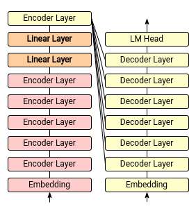

# TransCan: A Novel Approach to English-Cantonese Machine Translation

This research is supported by Cloud TPUs from Google's [TPU Research Cloud](https://sites.research.google/trc/about/) (TRC).

## Results

| Model | BLEU | File |
| :- | :-: | :- |
| **This Model** | **0.286** | [`results-bart.txt`](results-bart.txt) |
| Baidu Translate | 0.168 | [`results-baidu.txt`](results-baidu.txt) |
| Bing Translate | 0.155 | [`results-bing.txt`](results-bing.txt) |

- Source sentences: [`test.en.txt`](https://github.com/ayaka14732/wordshk-parallel-corpus/blob/v1/plus15/test.en.txt)
- References: [`test.yue.txt`](https://github.com/ayaka14732/wordshk-parallel-corpus/blob/v1/plus15/test.yue.txt)

## Repositories

TransCan consists of multiple repositories:

- [ayaka14732/lihkg-scraper](https://github.com/ayaka14732/lihkg-scraper)
- [ayaka14732/wordshk-parallel-corpus](https://github.com/ayaka14732/wordshk-parallel-corpus)
- [CanCLID/abc-cantonese-parallel-corpus](https://github.com/CanCLID/abc-cantonese-parallel-corpus)
- [ayaka14732/bart-base-jax](https://github.com/ayaka14732/bart-base-jax): JAX implementation of the BART model. This is the base model for all experiments in this study. All modifications to the model architecture have been made on the basis of this repository.
- [ayaka14732/bart-base-cantonese](https://github.com/ayaka14732/bart-base-cantonese)
- [ayaka14732/TransCan](https://github.com/ayaka14732/TransCan)

Model weights:

- 2nd-stage pre-training: [Hugging Face Hub](https://huggingface.co/Ayaka/bart-base-cantonese)
- 1st-stage fine-tuning: [Google Drive](https://drive.google.com/file/d/1MX0LYW5jhB72g3F_WAKQm1nZVQyuD_nl/view)
- 2nd-stage fine-tuning: [Google Drive](https://drive.google.com/file/d/1IfsLd_KDnYO7nUqN0JcHoy2oLif2u4V6/view)

Training details on W&B:

- 2nd-stage pre-training: [`1j7zs802`](https://wandb.ai/ayaka/bart-base-cantonese/runs/1j7zs802)
- 1st-stage fine-tuning: [`3nqi5cpl`](https://wandb.ai/ayaka/en-kfw-nmt/runs/3nqi5cpl)
- 2nd-stage fine-tuning: [`2ix84gyx`](https://wandb.ai/ayaka/en-kfw-nmt-2nd-stage'/runs/2ix84gyx)

## Model Architecture

The TransCan model is based on the BART base model. It utilises two linear projection layers to connect the embedding and all but the last encoder layers in the English BART model with the embedding, the last encoder layer and all decoder layers of the Cantonese BART model.



## Steps to reproduce

The experiment is carried out on Google Cloud TPU v4-16, and the results can be reproduced on the same setups. Alternatively, the results can be reproduced on any setup with two hosts, each with four default devices (e.g. two hosts with 4 GPU devices on each host). These scripts can also be run on other environment setups to produce similar results, but the results would not be exactly the same.

```sh
# Clone source code and datasets
git clone https://github.com/ayaka14732/TransCan.git
git clone https://github.com/CanCLID/abc-cantonese-parallel-corpus.git
git clone https://github.com/CanCLID/wordshk-parallel-corpus.git

# set environment variables
cd TransCan
export EXTERNAL_IP=...  # the IP address of another host, e.g.: 10.130.0.27
echo $EXTERNAL_IP > external-ips.txt

# 1st-stage fine-tuning
git checkout fine-tune-1st-stage
python convert_params.py
./startpod python finetune.py

# 2nd-stage fine-tuning
git checkout fine-tune-2nd-stage
./startpod python 2_finetune.py

# Generate results
python 3_predict.py
python compute_bleu.py results-bart.txt

# Compare with Bing Translator
export TRANSLATE_KEY=...
export ENDPOINT=...
export LOCATION=...
python translate_bing.py
python compute_bleu.py results-bing.txt

# Compare with Baidu Translator
export BAIDU_APP_ID=...
export BAIDU_APP_KEY=...
python translate_baidu.py
python compute_bleu.py results-baidu.txt --fix-hai
```
